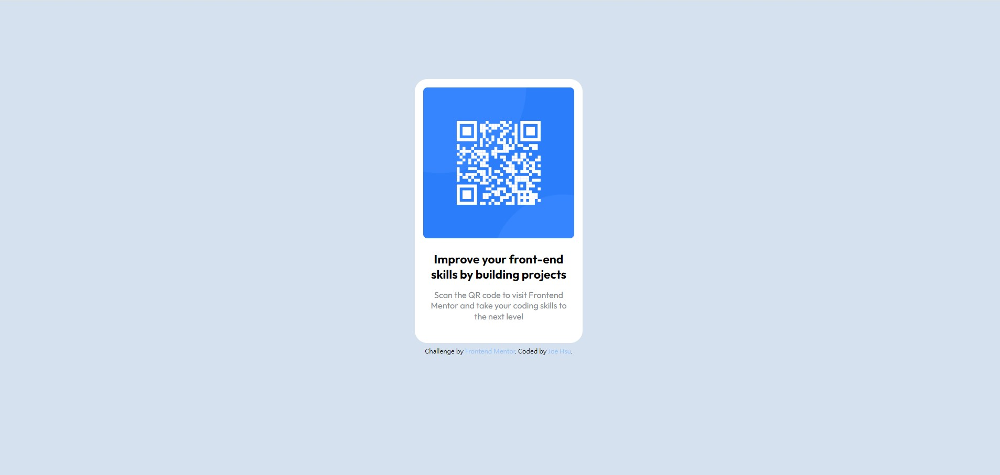

# Frontend Mentor - QR code component solution

This is a solution to the [QR code component challenge on Frontend Mentor](https://www.frontendmentor.io/challenges/qr-code-component-iux_sIO_H). Frontend Mentor challenges help you improve your coding skills by building realistic projects. 

## Table of contents

- [Overview](#overview)
  - [Screenshot](#screenshot)
  - [Links](#links)
- [My process](#my-process)
  - [Built with](#built-with)
  - [What I learned](#what-i-learned)
  - [Continued development](#continued-development)
  - [Useful resources](#useful-resources)
- [Author](#author)
- [Acknowledgments](#acknowledgments)

## Overview

### Screenshot




### Links

- Solution URL: [Solution Link](https://github.com/omd726/qr-code-component)
- Live Site URL: [Live site link](https://omd726.github.io/qr-code-component/)

## My process

### Built with

- Google Font
- [Tailwind CSS](https://tailwindcss.com/) - For styles

### What I learned

The title and paragraph are smaller than default size. Change size or weight didn't make it look the same as the demo jpg. That's why I decided to add scale into it.

```css
.scale-95 {
  --tw-scale-x: .95;
  --tw-scale-y: .95;
  transform: translate(var(--tw-translate-x), var(--tw-translate-y)) rotate(var(--tw-rotate)) skewX(var(--tw-skew-x)) skewY(var(--tw-skew-y)) scaleX(var(--tw-scale-x)) scaleY(var(--tw-scale-y));
}
```

### Continued development

Use this section to outline areas that you want to continue focusing on in future projects. These could be concepts you're still not completely comfortable with or techniques you found useful that you want to refine and perfect.

**Note: Delete this note and the content within this section and replace with your own plans for continued development.**

### Useful resources

- [Tailwind CSS](https://tailwindcss.com/) - Offical website. No need to say, the best tool for utility css.

## Author

- Website - JoeHsu (Will have in the future)
- Frontend Mentor - [@omd726](https://www.frontendmentor.io/profile/omd726)